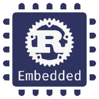

# 🦀 Rust on STM32F103C8T6 Template



This repository provides a ready-to-use template for running Rust projects on the STM32F103C8T6 microcontroller.

## 📋 Specifications

- Programming Language: Rust 🦀
- Target Hardware: STM32F103C8T6 (Blue Pill)
- Development Environment: Based on embedded-hal

## 🚀 Features

- Initial configuration for STM32F103C8T6
- RTT support for debugging
- Cargo.toml with initial settings and dependencies

## 🛠️ Prerequisites

- [Rust](https://www.rust-lang.org/tools/install)
- [thumbv7m-none-eabi](https://doc.rust-lang.org/nightly/rustc/platform-support/thumbv7m-none-eabi.html)
- [probe-rs](https://probe.rs/docs/getting-started/installation/)
- [arm-none-eabi-gcc](https://developer.arm.com/downloads/-/gnu-rm)

## 🔧 How to Use

1. Clone this repository:
``` sh
git clone https://github.com/ER-hamed/stm32f103c8t6-template.git && cd stm32f103c8t6-template
```
2. Build the project:
``` sh
cargo build --release
```
3. Flash binary to the microcontroller:
``` sh
cargo run --release
```

## 📁 Project Structure
    .    
    ├── src/
    │   └── main.rs
    ├── Cargo.lock
    ├── Cargo.toml
    ├── embed.toml
    ├── memory.x
    └── README.md
